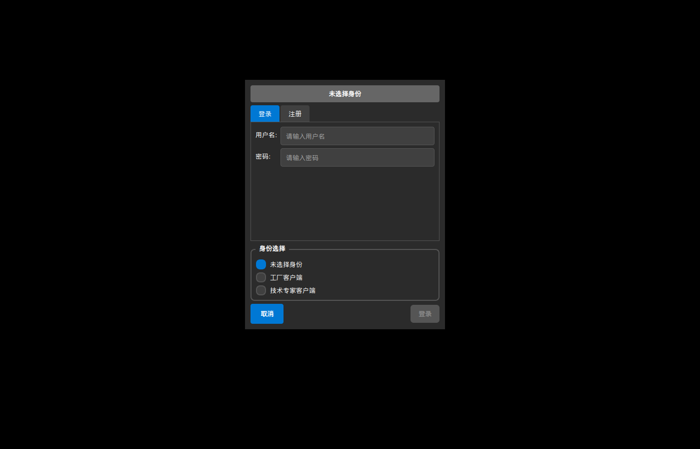

# Industrial Remote Expert - Complete Upgrade

A modern, role-aware client/server application for industrial remote assistance with Qt 5.12.8.

## Features

### 🔐 Authentication & Role Management
- **Unified Login/Register Dialog** with role selection
- **Three Role Types**: 未选择身份 (None), 工厂客户端 (Factory), 技术专家客户端 (Expert)
- **Role-Based Access Control** - each client enforces its role
- **Password Strength Validation** with visual feedback
- **Session Management** with secure token handling

### 🎨 Modern Dark Theme UI
- **Beautiful Dark Theme** with Windows-like layout conventions
- **Responsive Design** with dockable panels
- **Role-Specific Interfaces**:
  - **Expert Client**: Navigation panel, video grid (6 participants), participant controls, chat
  - **Factory Client**: Quick actions, device dashboard with KPI cards, camera preview, chat
- **Modern Controls** with hover effects and consistent styling

### 📊 Device Data Visualization (Factory Client)
- **Real-Time KPI Dashboard** with status indicators
- **Live Charts** using Qt Charts:
  - Pressure monitoring with trend visualization
  - Temperature monitoring with trend visualization
- **Device Simulation** with realistic sensor data
- **Alert System** with recent alerts display

### 💬 Enhanced Communication
- **Real-Time Chat** with modern interface
- **Multi-Party Video** support for up to 6 participants
- **Camera Controls** with auto-start preferences
- **Recording Controls** (UI ready)

### 🏗️ Architecture
- **SUBDIRS Project Structure** with clean separation
- **Shared Components**: Login dialog, modern styling, common protocol
- **Modular Design**: common, shared, server, client-expert, client-factory
- **Qt Charts Integration** for data visualization

## Build Requirements

### Ubuntu/Debian
```bash
sudo apt update
sudo apt install -y build-essential qtbase5-dev qtmultimedia5-dev \
                    libqt5charts5-dev libsqlite3-dev qttools5-dev
```

## Quick Start

### 1. Build All Components
```bash
./build.sh
```

Or build manually:
```bash
# Build with Qt Creator or manually:
qmake industrial-remote-expert.pro
make -j4
```

### 2. Run Applications

**Start the server:**
```bash
cd server && ./server
```

**Start Expert Client:**
```bash
cd client-expert && ./client-expert
```

**Start Factory Client:**
```bash
cd client-factory && ./client-factory
```

### 3. Login and Test

1. **Choose your role** in the login dialog (工厂客户端 or 技术专家客户端)
2. **Register a new user** or login with existing credentials
3. **Connect to server** (default: 127.0.0.1:9000)
4. **Create or join work orders** to collaborate

## Application Features

### Expert Client Features
- 🏗️ **Navigation Panel**: Server connection, work order list, device data
- 🎥 **Video Grid**: Support for up to 6 participants with modern layout
- 👥 **Participant Panel**: Online users, camera/audio controls, recording
- 💬 **Chat Interface**: Real-time messaging with modern UI
- 📊 **Device Data Monitoring**: View factory device status and alerts

### Factory Client Features  
- ⚡ **Quick Actions**: Create work orders, join existing work orders
- 📊 **KPI Dashboard**: Real-time monitoring of pressure, temperature, flow, etc.
- 📈 **Live Charts**: Trend visualization for critical parameters
- 🎥 **Camera Preview**: Local and remote video with controls
- 🚨 **Alert System**: Recent alerts and warnings display
- 💬 **Chat Interface**: Communication with experts
- 🎬 **Recording Controls**: Session recording capabilities

## Project Structure

```
industrial-remote-expert/
├── common/                 # Shared protocol and networking
├── shared/                 # UI components (login dialog, styling)
├── server/                 # Qt-based server application
├── client-expert/          # Expert client with navigation focus
├── client-factory/         # Factory client with dashboard focus
├── build.sh               # Build script
└── README.md              # This file
```

## Technical Details

### Protocol
- **TCP** for control messages and chat
- **UDP** for video/audio streams (ready for implementation)
- **JSON-based** message format with binary frame headers
- **Role-aware** message routing

### Database
- **SQLite** for user storage and work order management
- **Prepared statements** for security
- **Session token management**

### Security
- **Password hashing** with SHA-256 and salt
- **Session tokens** for authentication
- **Role-based access control**
- **Input validation** throughout

## Screenshots

### Expert Client

*Modern expert client with role-aware login and dockable panels*

### Factory Client  

*Factory client with KPI dashboard and device data visualization*

## Development Status

- ✅ **Phase 1**: Core authentication & project structure
- ✅ **Phase 2**: UI modernization & role-specific interfaces  
- 🔄 **Phase 3**: Enhanced server features (in progress)
- ⏳ **Phase 4**: Real-time communication improvements
- ⏳ **Phase 5**: Advanced features (recording, history)
- ⏳ **Phase 6**: Polish & documentation

## Contributing

This is a modern upgrade of an industrial remote assistance system. The codebase uses:
- **Qt 5.12.8** with C++11 compatibility
- **Dark theme** with modern UI patterns
- **Role-based architecture** for scalability
- **Component-based design** for maintainability

## License

Industrial Remote Expert - Copyright 2024